# DoConnect Application

DoConnect is an application that enables its users to ask and answer questions, as well as upload images to provide more context. It allows for topic-based and keyword-based searching of questions, and it notifies administrators via email when new questions or answers are added. Administrators have the ability to approve or delete questions and answers, as well as manage users. Users are also able to engage in chat conversations with one another. User authentication and authorization are implemented using JWT.

## Team Members 

* [Abdulkerim Mohammed] (https://github.com/abdulkwm)
* [Khoa Ho] (https://github.com/tenpointsdream)
* [Prajesh Sharma] (https://github.com/prajeshsharma)

## Introduction

* DoConnect is a Q&A platform that enables users to ask questions and receive answers from other users. In addition, DoConnect facilitates group chat conversations between users. The platform supports two types of user roles: User and Admin.
* Whenever a user submits a new question or answer, admins are notified via email. Admins have the authority to approve or delete the newly added content and can also manage other users on the platform.
* The DoConnect platform is built using Angular, Spring Boot, and MySQL.

## Objectives

* Our platform offers users the freedom to ask and answer questions on a wide range of topics. Users can filter questions based on particular topics or a query string to find relevant content. Admins can approve or delete any question or answer submitted by users, ensuring a safe and respectful community.

* We prioritize User Experience by designing a simple and intuitive interface that allows users to achieve their objectives with minimal effort. Our platform is responsive and can adapt to different screen sizes. Security is of utmost importance, and we use JWT to provide secure access to the platform.

* Our platform includes a chat feature that allows users to communicate with one another. Users can also add images to their questions and answers, providing additional context and reference for other users. To ensure Admins stay up-to-date on user activity, we send email notifications whenever a new question or answer is added to the platform.

## Technologies Used

### Backend

* Spring Boot
* Spring Data JPA
* Spring Boot Starter Mail
* Maven for managing packages
* Java JDK 1.8
* Tomcat Server
* MySQL Database
* JWT (for authentication and authorization)
* Postman Client(to create and send API requests)

### Data Base
* MySQL

### Frontend

* Angular
* TypeScript
* Node JS
* NPM for managing packages
* VSCode (IDE)
* Angular CLI
* Bootstrap 5 (for styling pages)
* HTML5
* CSS
* JWT (for authentication)

## Use Case Diagram
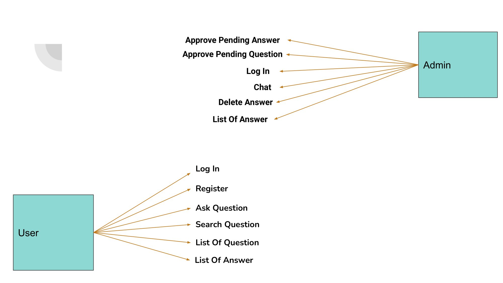

## Microservices

### DoConnect Main Microservice

* User authentication and authorization
* Storing and retrieving questions, answers, 
* Sending email to admins.  

Controllers:
* AnswerController
* QuestionController
* UserController
* AuthenticationController
* CustomerController

### DoConnect Chat Microservice

Responsible for:
* Storing and retrieving user chats.

## UI pages
### Landing Page
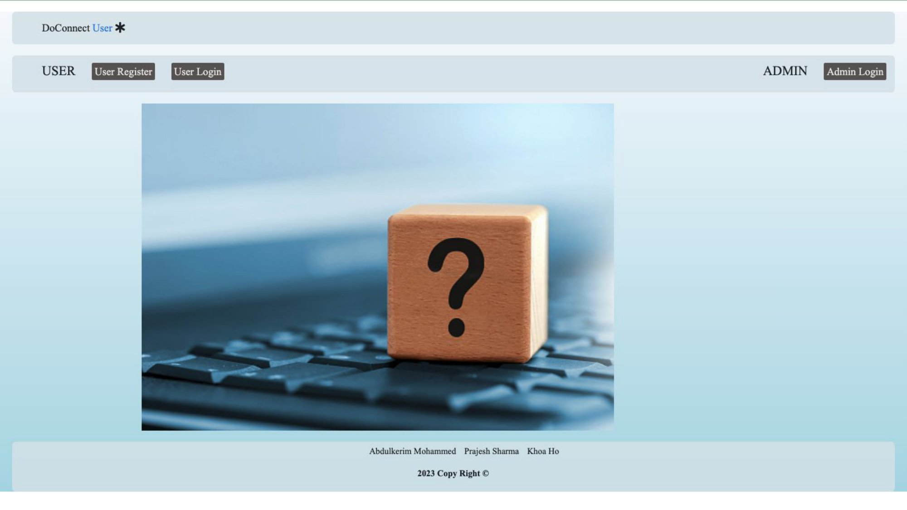
### User Registration Page
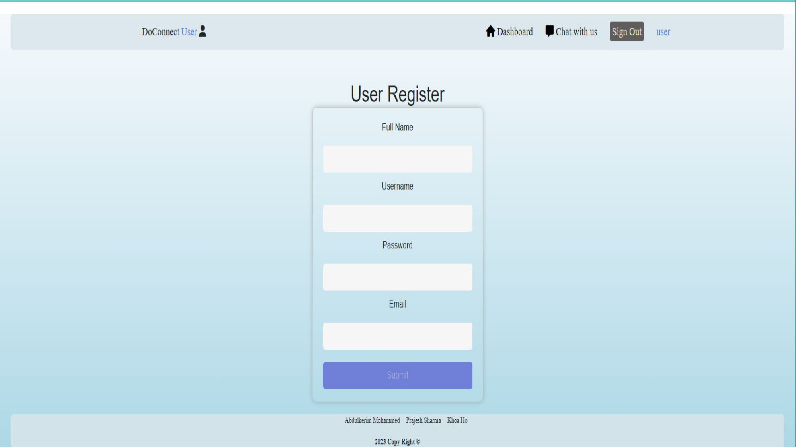
### User LogIn Page
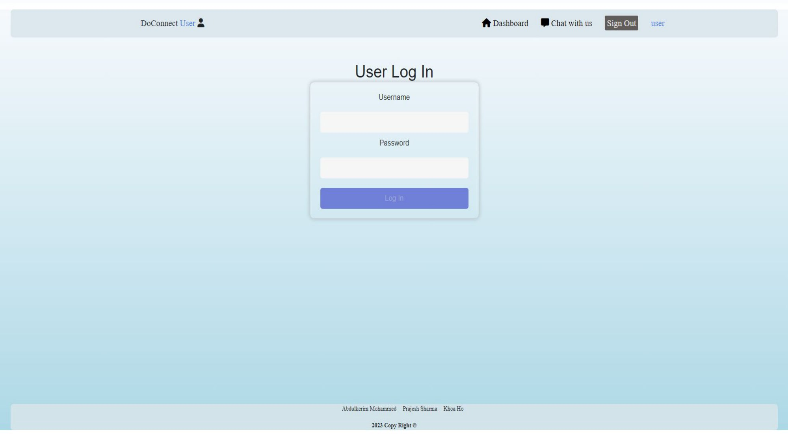
### Admin LogIn Page
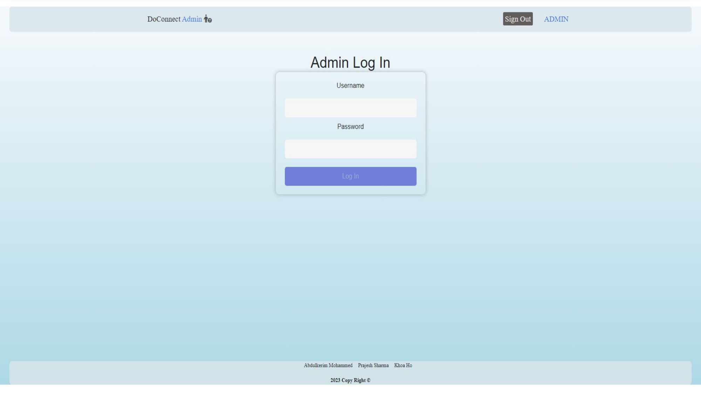
### Admin Pending Question Page
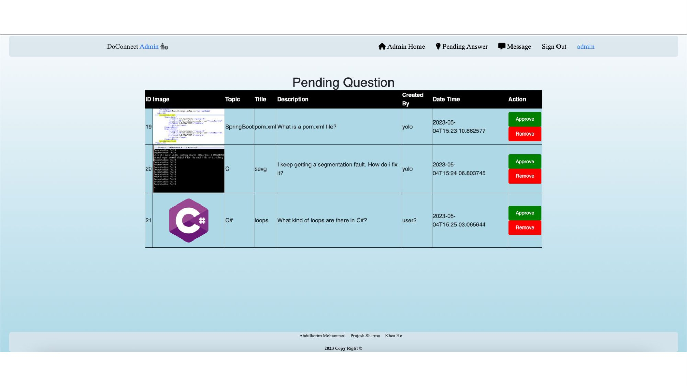
### Admin Pending Answer Page
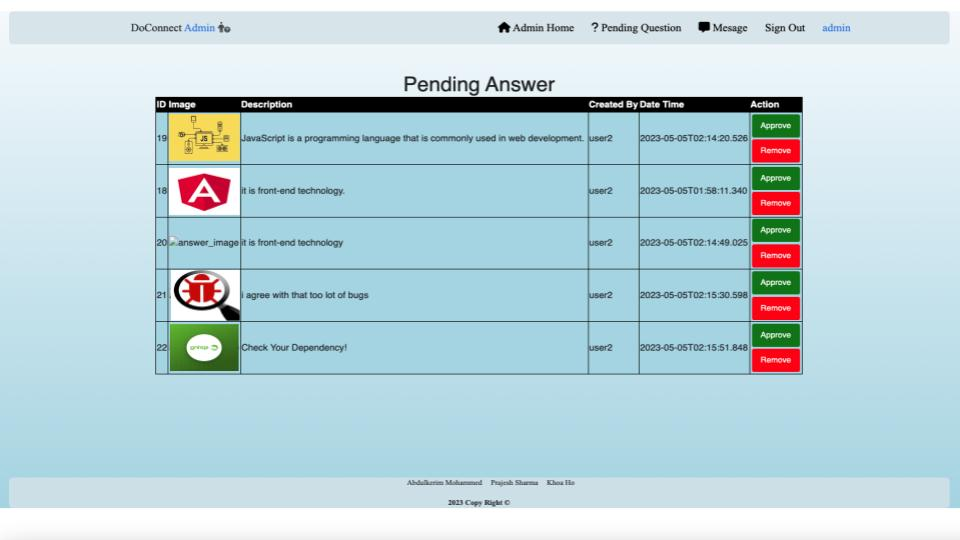
### Admin HomePage
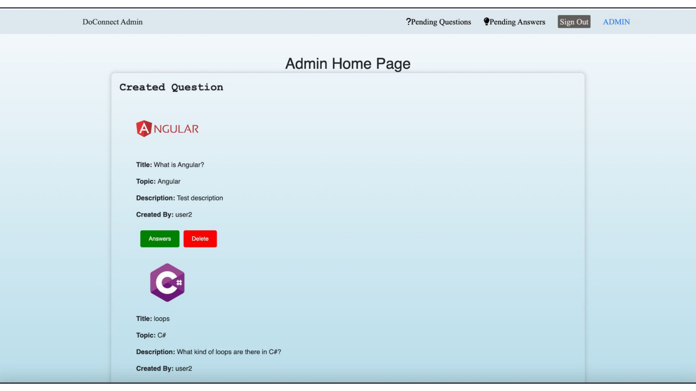
### User HomePage
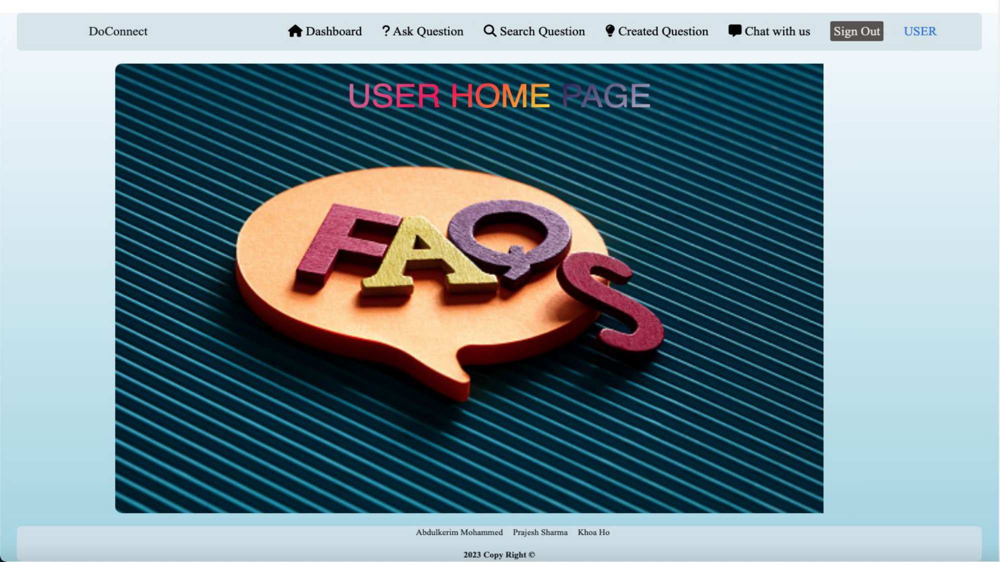
### Create Question Page
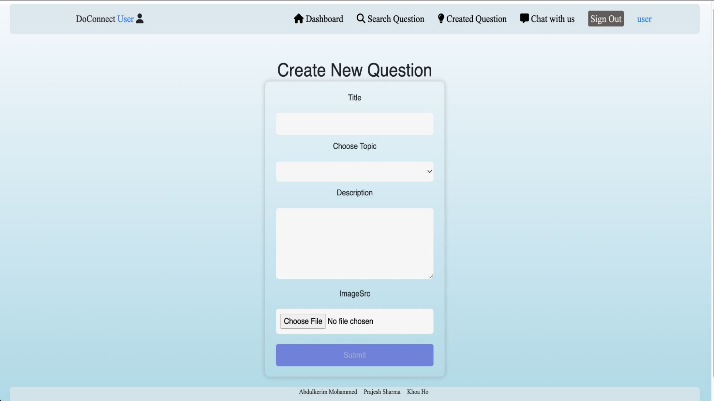
### Created Question Page
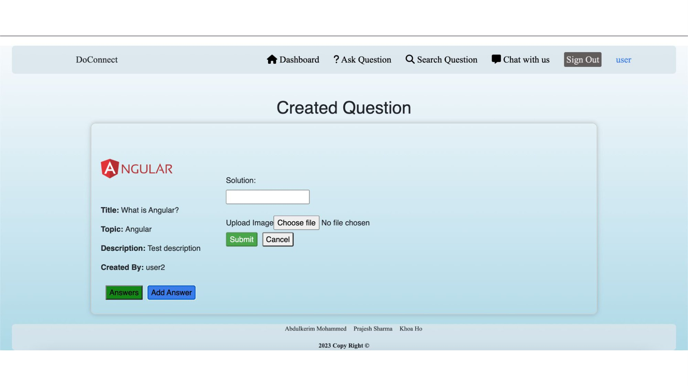
### Search Question Page
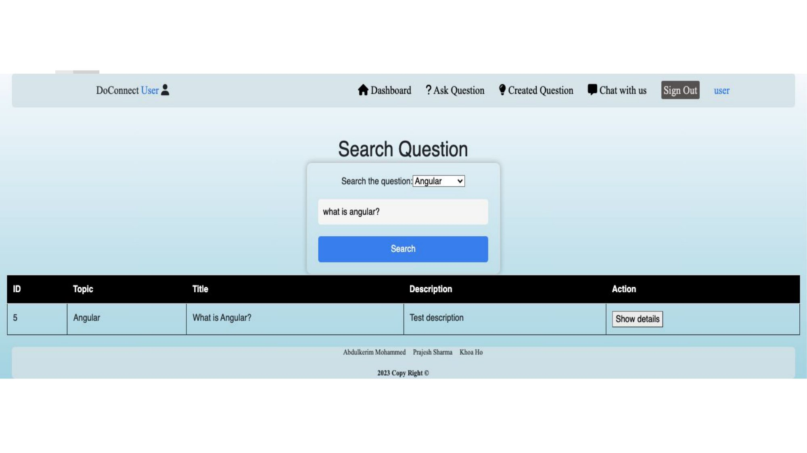
### User-to-User Chat Page
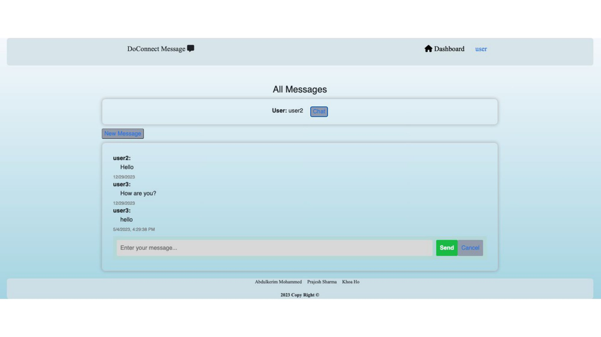

## Project Pdf
[Project-UI-Pages](./Capstone-project.pdf)
